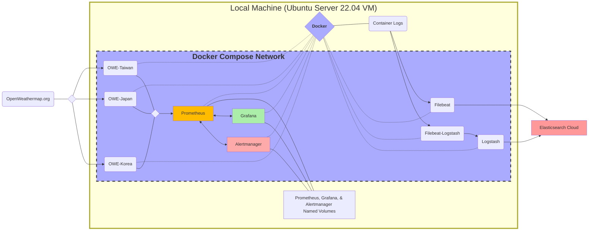

# Project Goals
1.  Become more familiar with monitoring and logging using Prometheus/Grafana and Elasticsearch/Kibana.
2.  Practice using Docker Compose by running the above mentioned applications in a containerized environment
3.  Perform points (1) and (2) while trying to follow version control best practices: self-reporting, documentation, reproducibility, and creating reliable checkpoints in case changes need to be rolled back.

---

Using [mermaid](https://github.com/mermaid-js/mermaid) I've created a rough diagram of the project

## Outline
&emsp;The core of this project is the relationship between Prometheus and the Exporters. They simulate having offsite resources that produce metrics for Prometheus(visible at localhost:9090) to periodically scrape and create time series data. This data is then able to be presented visually in the Grafana(::1:3000) container as well as produce alerts with Alertmanager(::1:9093). The exporter's metrics pages could be exposed to your local machine by configuring the docker-compose.yml, but I believe it's ultimately unecessary. Using external volumes Prometheus's TSDB and Grafana customizations are stored outside the containers' lifecycle (as well as Alermanager's alert history, but that was not utilized). Local configuration files are primarily shared to the containers at runtime with bind mounts for ease of editing and deployment.

&emsp;The next step of the project was adding Filebeat and Logstash containers to export the project's container logs to Elasticsearch and Kibana. I tested those containers locally, but it was too resource intensive to host all the applications at the same time. I used Elastic's 2 week cloud trial to have an Elastic front-end to view and query the collected logs.
## Steps to Reproduce
&emsp;If for some reason you wanted to try this project yourself, there are a few more steps to starting than cloning the repo and entering *docker compose up -d* into your shell. Further there are "sensitive" parts of this project not fit to share on a public repositories (I did get to practice scrubbing the repo after pushing my free Openweathermap API key one Friday afternoon as well as realize Logstash was exposing my Elastic Cloud credentials). I assume you have a functioning Docker Engine/Desktop, so I will try to list the parts you need to fill in or modify.

1. Create the named volumes for Prometheus, Grafana, and Alertmanager. They are defined as external, and need to be created separate from a docker compose command.
    - This is because *docker compose down* will delete volumes created by the project i.e. Grafana Dashboard customization and Prometheus's TSDB.
2. Get an [Openweathermap](https://openweathermap.org/) API key.
    - Store it as an environment variable OW_APIKEY in ./secrets/owe_api_keys.env
3. Edit ./docker-compose.yml:services:OWE-* to target wherever's weather you're interest in monitoring.
4. If you change the names of the Exporters, you'll need to modify them accordingly in ./prometheus/prometheus.yml (scrape-configs:targets)

&emsp;With this you can run *docker compose --profile scrape up -d* and view the running containers. If you want to run the Elastic component there is still more to do.

5. Create an Elastic cloud (trial) [account](https://www.elastic.co/cloud/).

6. Create ./secrets/filebeat.env and ./secrets/logstash.env with the appropriate environment variables
    > filebeat.env:   ELASTIC_CLOUD="https://*elastic:\<GeneratedPassword\>*.*\<CloudServiceURL\>*:443/"   
    > logstash.env:   CLOUD_ID=*\<CloudMachineName\>:\<GeneratedServiceId\>*   CLOUD_AUTH=*elastic:\<GeneratedPassword\>*   CONF_OUTPUT_URL="https://*elastic:\<GeneratedPassword\>*.*\<CloudServiceURL\>*:443/"

    6a. If you wanted to avoid Logstash writing the environment variable credentials into your config files at run time you need to implement them in a [keystore](https://www.elastic.co/guide/en/logstash/current/keystore.html). It's unplesant but the process I found recommended is to run a Logstash container, use *docker exec* to enter a logstash container and [create a keystore](https://www.elastic.co/guide/en/logstash/current/keystore.html#creating-keystore) with the above needed credentials (remember the password).
    
    6b. Then with *docker cp* you can copy the encrypted keystore to your host machine.
    
    6c. Finally to the ./secrets/logstash.env you only need to pass *LOGSTASH_KEYSTORE_PASS=\<YourPassword\>*

N.B. I designated the logs' output format as json with the plan to manipulate them in Logstash later, but I prefer their non-json representations for reading. That can be altered in the docker-compose.yml:services:[service]:command field for Prometheus and Alertmanager. For Grafana, Filebeat and Logstash, you'll need to check their respective configuration files. 

---

## Closing Remarks
&emsp;Ultimately the time for comprehending the Elastic stack caused me scale back alternative goals. With more time to devote to the project I would first like to create and package a grafana dashboard. There appear to be a few plugins that would be interesting to try (like this [windspeed one](https://grafana.com/grafana/plugins/fatcloud-windrose-panel/) or integrate a [geomap](https://grafana.com/docs/grafana/latest/panels-visualizations/visualizations/geomap/)). The Alerting rules could be created to have functional warnings about unpleasant weather. Also the "Steps to Reproduce" could be packaged in a script to streamline the set up.